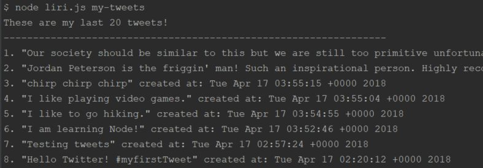
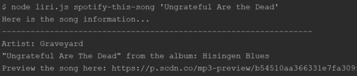
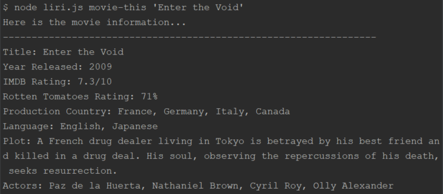
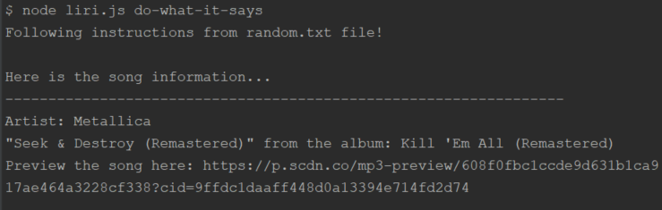
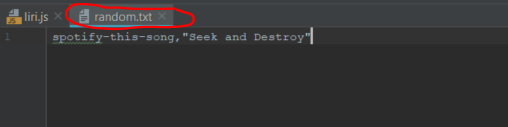

# LIRI-Bot
LIRI, short for Language Interpretation and Recognition Interface, is a command line node app that takes in parameters and gives you back data.

## How to use LIRI

In your terminal type any of the following...

### node.js my-tweets

Returns my top 20 tweets

### node.js spotify-this-song 'song name here'

Returns information about the song and preview link

### node.js movie-this 'movie name here'

Returns information about the movie

### node.js do-what-it-says

Performs the command located in the random.txt file

